<div align="center">



<br/><br/>

<a href="https://github.com/ArioMoniri/Qedit/releases/latest/download/Qedit.dmg"></a>
&nbsp;
<a href="#-install"></a>

<br/><br/>

[](https://github.com/ArioMoniri/Qedit/actions/workflows/release.yml)


[](LICENSE)

</div>

> ### 🔎 macOS can *preview* almost anything — but it can't *edit* it.
> **Qedit fixes that.** Find, edit and save **text, code, Markdown, Word, Excel, PowerPoint and PDF** — each **straight back in its own format**. Click a file in Qedit's **Browser** and edit it right there, like a preview pane you can type into. A `.pdf` stays a `.pdf`. A `.docx` stays a `.docx`. No conversion, ever.

<div align="center">

</div>

## ✨ What you get

| | Feature |
|---|---|
| 🗂️ | **Browser window** — a folder list beside a **live, editable** editor. Click a file and edit it *right there* (⌘F, save in place) — no Space, no shortcut. The closest macOS allows to "edit in the preview." |
| ✍️ | **Edit (almost) any format in place** — text, code, Markdown, **Word/RTF/ODT**, **Excel cells**, **PowerPoint text**, SVG, JSON/YAML/CSV — each saved back in its *own* format, never converted |
| 📄 | **A real PDF editor** — find + jump-to-result, highlight, sticky notes, text boxes, **replace text** (matches the original font/size/color), ✍️ signatures, page ops, optional flatten-on-save |
| 🖍️ | **Live change highlighting** — see exactly what you changed: added/edited text is marked, removals flagged — in text, code, Word, Excel and PowerPoint |
| 👀 | **Rich Quick Look previews** — Markdown, source, logs, JSON/YAML/XML with highlighting, math (KaTeX), emoji, dark mode & remembered scroll — and the window falls back to **any Quick Look plugin you have installed** for everything else |
| ⌨️ | **Editing one keystroke from Finder** — **⌥⌘E** opens the selection (rebindable), **⌥⌘B** opens the Browser (rebindable), or **follow the Finder selection** live |
| 🧩 | **Extension manager** — list every Quick Look extension + the types it claims, **enable/disable** them, reset the QL cache, inspect any file's UTI |
| 🔄 | **Auto-updates** — [Sparkle](https://sparkle-project.org), EdDSA-verified, installed in the background, with an in-app **Updates** page |

<sub>👉 Expand any section below for the details.</sub>

<details>
<summary><b>🗂️ Browser — a folder list + a live, editable preview pane</b></summary>

<br/>

Open the **Browser** (⌥⌘B, the dashboard card, or the menu bar): a folder list on the left, a **real editor** on the right.

- **Click a file → it opens ready to edit**, right there — find with ⌘F, save in place. No Space, no hotkey, no extra click.
- Switching files while you have unsaved edits **asks before discarding** them.
- Reuses every editor (text, code, Word, Excel, PowerPoint, PDF) and falls back to **macOS Quick Look** for anything else.
- Prefer the Finder? Turn on **Follow Finder selection** and the editable Quick Panel tracks whatever you click in Finder — a live, editable preview pane.

> Apple's own Quick Look pane (Space / Finder's preview) is **read-only and takes no keystrokes** — *no* app can edit inside it. The Browser is Qedit's own editable equivalent.

</details>

<details>
<summary><b>✍️ Edit every supported format — in its own format</b></summary>

<br/>

| Type | What you can do |
|---|---|
| Text · code · Markdown · SVG · JSON · YAML · CSV | Full editing, ⌘F find, syntax colors, change highlighting |
| **Word** `.docx` `.doc` · **RTF** · **ODT** | Edit as rich text; saves back in place (a `.bak` is kept first — optional) |
| **Excel** `.xlsx` | Edit cells; a **minimal-diff** writer rewrites *only* changed cells and preserves styles/formulas |
| **PowerPoint** `.pptx` | Edit title/bullet text in place (opt-in) beside the rendered slides; layout & images preserved |
| **PDF** | Find, annotate, replace text, page ops, save in place |

Word/Excel are editable by default; PowerPoint text editing is an opt-in toggle. Everything saves back in the **same** format — Qedit never converts. Anything Qedit can't edit gets a read-only Quick Look preview instead.

</details>

<details>
<summary><b>📄 PDF editor — find, annotate, reorganize, save in place</b></summary>

<br/>

- **Find** across the whole document with live match count and **jump-to-result** (highlighted).
- **Annotate**: text highlights, sticky **notes**, free-text **boxes**, and freehand **✍️ signatures** (draw once in a sheet, click to place anywhere). Pick any annotation color.
- **Pages**: rotate, delete, insert blank, insert pages from another PDF, **reorder**, and **extract** a page to a new file.
- **Copy as plain text** — selection or the whole document.
- **Save in place** writes back to the same `.pdf` via PDFKit. An optional timestamped `.bak` is made before the first write.
- A thumbnail sidebar for quick navigation.

</details>

<details>
<summary><b>👀 Quick Look previews — for the types macOS shows as flat text</b></summary>

<br/>

Press <kbd>Space</kbd> in Finder and Qedit renders:

- **Markdown** (`.md`, `.markdown`, `.textbundle`) — full GitHub-flavored rendering.
- **Source code** — 30+ languages, highlighted with highlight.js.
- **Logs** (`.log`) — monospace with level coloring (error / warn / info).
- **Config** — JSON, YAML, XML, plist.

All assets are **bundled** (works offline, sandbox-safe), the file text is base64-embedded so nothing can break the page, light/dark follows the system, and your scroll position is remembered per file. Qedit **never** registers system types like PDF/JPEG/PNG — Apple's own previews stay in charge there.

</details>

<details>
<summary><b>⌨️ Hotkey &amp; Quick Action — editing is one keystroke from previewing</b></summary>

<br/>

- **Global hotkey** (default **⌥⌘E**, fully rebindable in Settings): select a file in Finder, press it, and that file opens in the editor.
- **Browser hotkey** (default **⌥⌘B**, rebindable): opens the folder Browser with the live editable pane from anywhere.
- **Follow Finder selection** (opt-in): while the Quick Panel is open, clicking through files in Finder re-loads each one into it.
- **Finder Quick Action / Service**: right-click a file → Quick Actions → **Open in Qedit**.
- All route through the `qedit://` URL scheme / Carbon hotkeys to the (unsandboxed) host app, so editing real files just works.

The first hotkey use asks macOS for permission to read the Finder selection — that's the standard Automation prompt.

</details>

<details>
<summary><b>🧩 Extension manager — see, toggle &amp; diagnose Quick Look extensions</b></summary>

<br/>

- **Lists every installed Quick Look preview extension** (via `pluginkit`) with its bundle id, enabled state, and the UTIs it claims.
- **Enable / disable** any extension — per-row, or **Enable All / Disable All**. (Some first-time activations still need a one-time approval in System Settings; Qedit links you there.)
- **Reset the Quick Look cache** (`qlmanage -r`).
- **UTI inspector**: drop any file to see its resolved type, MIME, conformances, and exactly which extension would preview it.
- Surfaces **`brew outdated --cask`** for extensions you installed via Homebrew — it never updates apps it didn't install.

</details>

<details>
<summary><b>🔄 Auto-updates — Sparkle, signed and verified</b></summary>

<br/>

Qedit ships with [Sparkle](https://sparkle-project.org). It checks a signed `appcast.xml`, verifies each update against an **EdDSA** public key baked into the app, then downloads, installs, and relaunches — all in the background. The **Updates** page lets you toggle automatic checks, check now, or grab the latest build manually. Every release is Developer-ID signed **and** notarized.

</details>

## 🚫 What it won't do (on purpose — these are real macOS limits)

- **Never** changes or renames your file's format. Edits write back in the original format.
- **Never** hijacks Apple's built-in PDF/image previews — Qedit only previews types macOS renders poorly.
- **Never** silently overrides system security — a macOS approval may still be required; Qedit guides you, it doesn't pretend.
- **Can't edit inside Finder's own Quick Look pane.** That region (Space / the preview column) is read-only and delivers no keystrokes to *any* app — so Qedit gives you the **Browser** window and the **follow-Finder Quick Panel** instead, the closest legitimate equivalents.
- **`.webarchive` stays read-only** (re-saving it would silently drop its images/scripts), and PDF editing is overlay-based, not Acrobat-style glyph reflow.

## 📦 Install

### ⚡ One command — the whole suite (Qedit + ChangeX + Quick Look)

Installs **Qedit** (find + edit any file) **and** [**ChangeX**](https://github.com/ArioMoniri/changex) (tracked-changes + preview), and turns on their Quick Look previews — in a single step.

**macOS / Linux**

```bash
/bin/bash -c "$(curl -fsSL https://raw.githubusercontent.com/ArioMoniri/Qedit/main/scripts/install.sh)"
```

**Windows** (PowerShell)

```powershell
irm https://raw.githubusercontent.com/ArioMoniri/Qedit/main/scripts/install.ps1 | iex
```

> The scripts only use Homebrew (Qedit) and `uv`/`pipx`/`pip` (ChangeX), and print every download link — nothing else runs. Read [`scripts/install.sh`](scripts/install.sh) / [`scripts/install.ps1`](scripts/install.ps1) first if you like.

### 🖥 What runs where

Qedit's edit-in-Quick-Look features use **macOS-only** frameworks (QuickLookUI · AppKit), so the **Qedit app is macOS-only**. The cross-platform half of the suite is **ChangeX** (Python + a Tauri viewer), which runs everywhere.

| | macOS | Windows | Linux |
|---|:---:|:---:|:---:|
| **Qedit** app + in-place editor | ✅ | — | — |
| **Qedit** Quick Look preview | ✅ | — | — |
| **ChangeX** CLI · MCP · `changex view`/`preview` | ✅ | ✅ | ✅ |
| **ChangeX** Viewer app | ✅ `.dmg` | ✅ `.msi` | ✅ `.AppImage` |
| **ChangeX** native preview | ✅ Quick Look (Space) | ✅ Explorer pane (Alt+P) | `changex view` |
| Press-**Space** preview like macOS | built-in | install [**QuickLook for Windows**](https://github.com/QL-Win/QuickLook) | — |

> **On Windows?** You get ChangeX + its Explorer preview pane. For a macOS-Quick-Look-style **Space** preview, grab the free **QuickLook** app: `winget install QL-Win.QuickLook`. (Qedit itself has no Windows build — see above.)

### 🍎 Just Qedit (macOS)

```bash
brew tap ariomoniri/qedit https://github.com/ArioMoniri/Qedit
brew install --cask qedit
```

Or grab the signed, notarized [**`Qedit.dmg`**](https://github.com/ArioMoniri/Qedit/releases/latest) and drag it to Applications. Then open Qedit once, go to **Setup**, and tap **Enable Qedit Preview**. Press <kbd>Space</kbd> on a `.md`/`.swift`/`.log` to see it. 🎉

## 🛠 Build from source

Needs Xcode 16+ and [XcodeGen](https://github.com/yonsm/XcodeGen).

```bash
brew install xcodegen
xcodegen generate        # project.yml → Qedit.xcodeproj (git-ignored)
open Qedit.xcodeproj      # ⌘R to run
```

<details>
<summary><b>🏗 Architecture &amp; project layout</b></summary>

<br/>

```
Sources/
  Qedit/                host app — editor (B), manager (C), updates, onboarding, hotkey
  QuickLookExtension/   Module A — the Quick Look preview (sandboxed, read-only)
  QuickActionExtension/ Finder Quick Action → hands the file to the editor
  Shared/               code compiled into all three targets
scripts/                build_release.sh + notarize.sh
.github/                release workflow + README assets
```

One host `.app`, three targets:

| Target | Kind | Role |
|---|---|---|
| `Qedit` | App (SwiftUI/AppKit) | Editor, manager, updates, onboarding, hotkey |
| `QeditQuickLook` | QL preview app-extension | **Module A** — rich previews for non-system UTIs |
| `QeditQuickAction` | Action/Service app-extension | Hands the Finder selection to the editor |

The host app is **unsandboxed** (Developer ID) so the manager can shell out to `pluginkit`/`qlmanage`/`brew` and the hotkey can read the Finder selection. Both extensions **are** sandboxed and read-only. Project files are generated by XcodeGen from `project.yml` (the `.xcodeproj` is git-ignored).

</details>

<details>
<summary><b>🚀 Releasing (maintainers)</b></summary>

<br/>

Pushing a `vX.Y.Z` tag runs [`.github/workflows/release.yml`](.github/workflows/release.yml): build → **Developer-ID sign** → **notarize** → EdDSA-sign the Sparkle appcast → publish the DMG + appcast as release assets, with notes pulled from `CHANGELOG.md`. Everything comes from the `APPLE_*` and `SPARKLE_ED_PRIVATE_KEY` Actions secrets.

```bash
git tag v0.2.0 && git push origin v0.2.0   # 🪄 that's the whole release
```

</details>

## ❓ FAQ

<details>
<summary><b>Will Qedit ever change or convert my files?</b></summary>
No. Edits always write back to the original file in its original format. A `.pdf` stays a `.pdf`. The only extra file it may create is an optional timestamped `.bak` before the first save.
</details>

<details>
<summary><b>Does it replace Apple's spacebar PDF/image preview?</b></summary>
No — and it can't. macOS reserves those previews for its own handlers, and Qedit deliberately never registers system UTIs. Qedit only previews types macOS renders as flat text.
</details>

<details>
<summary><b>Is it safe? Signed?</b></summary>
Yes. Every release is signed with a Developer ID certificate and notarized by Apple, so Gatekeeper accepts it cleanly. Updates are additionally verified against an EdDSA key.
</details>

<details>
<summary><b>My preview isn't showing — what do I do?</b></summary>
Open Qedit → <b>Extensions</b> and make sure <b>Qedit Preview</b> is enabled (or hit <b>Enable Qedit Preview</b> in Setup). If macOS still ignores it, approve it in System Settings → General → Login Items &amp; Extensions → Quick Look, then use <b>Reset Quick Look Cache</b>. Logging out and back in helps macOS pick it up.
</details>

<details>
<summary><b>The hotkey doesn't open anything.</b></summary>
The first use needs permission to control Finder (System Settings → Privacy &amp; Security → Automation). Make sure a file is actually selected in the front Finder window, and that the shortcut is enabled in Settings → Hotkey.
</details>

## 🗺 Roadmap

- [x] **M1** — Quick Look previews + in-place text editor
- [x] **M2** — PDFKit editor + Quick Action + ⌥⌘E hotkey
- [x] **M3** — Quick Look extension manager (enable/disable · `qlmanage -r` · UTI inspector)
- [x] **M4** — Sparkle auto-updates · theming · Developer-ID notarized release

See [**CHANGELOG.md**](CHANGELOG.md) for what changed in each version. 📝

## 📄 License

[MIT](LICENSE) © 2026 **Ariorad Moniri**.

<div align="center"><sub>Built with Swift, SwiftUI, AppKit & PDFKit on macOS. 🛠</sub></div>
